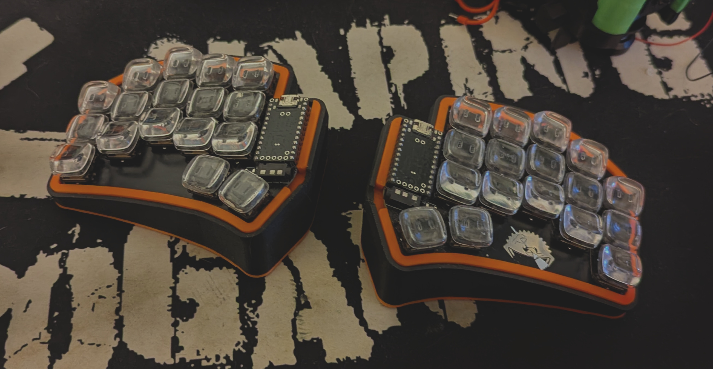
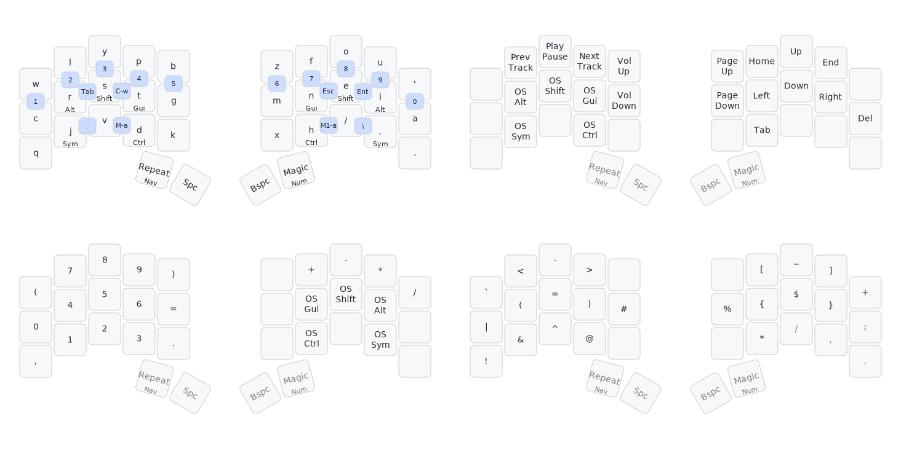

# QMK Keymaps

<div align="center">

</div>

## Table of Contents
- [Installation](#installation)
- [About](#about)
- [Features](#features)
- [My Keymap](#my-keymap)
- [References](#references)

## Installation

### Prerequisites
Follow the [getting started](https://docs.qmk.fm/#/newbs_getting_started) docs to install [QMK Firmware](https://docs.qmk.fm/#/)

### Setup
```sh
# Clone the userspace
git clone https://git.sajenim.dev/jasmine/qmk_userspace.git

# Configure QMK to use external userspace
qmk config user.overlay_dir="$(realpath qmk_userspace)"

# Compile for Ferris Sweep
qmk compile -kb ferris/sweep -km sajenim

# Flash to keyboard (enter bootloader mode first)
qmk flash -kb ferris/sweep -km sajenim
```

## About

This is a custom QMK userspace for the Ferris Sweep keyboard, featuring the **[Canary layout](https://github.com/Apsu/Canary)** - a collaborative design by the Alternate Keyboard Layout (AKL) community with over 55% rolling trigrams for a flowy typing feel. The keymap includes extensive customizations for improved typing efficiency, emphasizing minimal finger movement through home row mods, combos, and intelligent repeat keys.

### Design Philosophy
- **Comfort first**: All frequently used keys accessible without leaving home position
- **Smart automation**: Let the keyboard handle common patterns (repeat key, magic completions, autocorrect)
- **Minimal layers**: 5 carefully designed layers (CANARY, NAV, NUM, SYM, FUN) with logical access patterns

## Features

### Autocorrect
Automatically fixes common typing mistakes in real-time. Maintains a dictionary of frequently mistyped words and corrects them as you type, reducing the need for manual backspacing and retyping.

### Combos
Press multiple keys simultaneously to output different characters or trigger actions. Enables access to numbers, symbols, and commands without leaving the home position, reducing finger travel and improving typing efficiency.

### Home Row Mods
Modifier keys (Alt, Shift, GUI, Ctrl) placed on the home row as dual-function keys. Tap for the letter, hold for the modifier. Eliminates the need to reach for traditional modifier positions, reducing hand movement and strain.

### Repeat / Magic Keys
Two intelligent repeat mechanisms on the thumb keys:
- **Repeat Key** - Repeats the last keystroke with context-aware enhancements for common trigrams and word briefs
- **Magic Key** - Context-aware completions based on the previous key. Reduces same-finger bigrams and enables common word completions

See [**magic sturdy**](https://github.com/Ikcelaks/keyboard_layouts/blob/main/magic_sturdy/magic_sturdy.md) for the inspiration behind the magic key implementation.

## My Keymap

<div align="center">

</div>

### Usage Examples

**Combos for Numbers:**
Press home row + upper row simultaneously for vertical number access:
- `L + R` → 2
- `Y + S` → 3
- `P + T` → 4

**Magic Key Completions:**
Type a letter, then press the Magic key (right thumb):
- `w` + Magic → `which`
- `b` + Magic → `efore`
- `+` + Magic → `=` (creates `+=`)

**Repeat Key Enhancements:**
Tap a key twice using the Repeat key (left thumb):
- `a` + Repeat → `nd` (completes "and")
- `i` + Repeat → `ng` (completes "ing")
- `.` + Repeat → `./` (first repeat), `../` (second repeat)

For complete documentation of all repeat and magic key behaviors, see the [wiki](https://git.sajenim.dev/jasmine/qmk_userspace/wiki).

## References

**[Precondition](https://precondition.github.io/home-row-mods)**<br>
Home row mods timing and configuration guidance

**[Pascal Getreuer](https://getreuer.info/posts/keyboards/index.html)**<br>
Advanced QMK features and custom keycodes

**[Ikcelaks](https://github.com/Ikcelaks/keyboard_layouts/tree/main)**<br>
Magic key implementation and layout analysis

**[Jonas Hietala](https://www.jonashietala.se/series/t-34/)**<br>
Keyboard layout development journey
